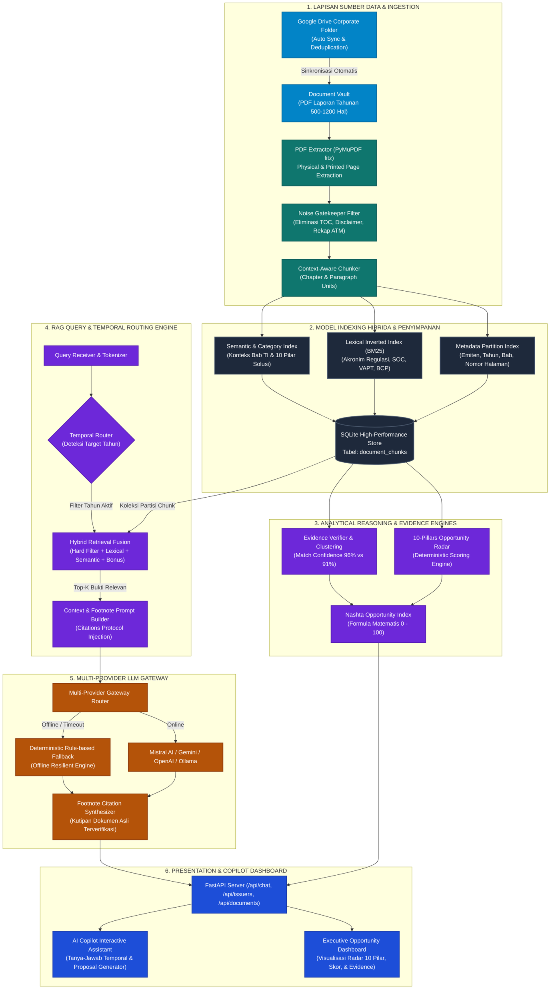
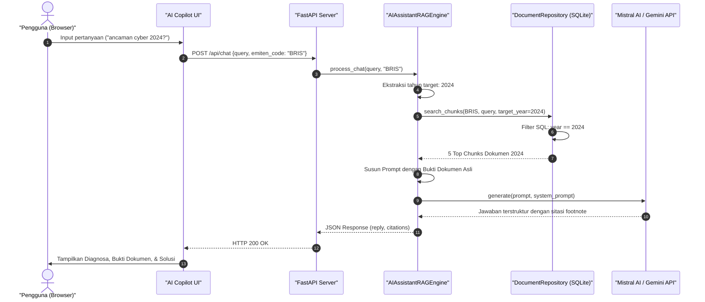

# Arsitektur Sistem

Dokumen ini menjelaskan arsitektur perangkat lunak, komponen inti, dan alur data *end-to-end* dari sistem **Nashta Annual Report RAG & AI Copilot**.

---

## 📐 Gambaran Umum Arsitektur

Sistem dibangun menggunakan pendekatan modular berbasis **Python (FastAPI)** pada backend dan antarmuka web responsif berbasis **Vanilla JavaScript & Tailwind CSS** pada frontend, tanpa dependensi framework frontend yang berat.


---

### 🌐 System Context Diagram


---

## 📐 Arsitektur Sistem RAG Terintegrasi

Sistem mengadopsi arsitektur **True RAG Terintegrasi (Enterprise Hybrid RAG)** yang menghubungkan berkas Laporan Tahunan berukuran besar (500–1.200+ halaman) dengan antarmuka visualisasi eksekutif serta asisten AI interaktif.



---

## ⚡ Model Indexing Hibrida (Hybrid Indexing Pipeline)

Dokumen Laporan Tahunan memiliki karakteristik data yang heterogen: perpaduan antara **terminologi regulasi formal**, **akronim teknis industri spesifik** (seperti *SOC*, *VAPT*, *SIEM*, *DRP*, *ISO 27001*, *BI-FAST*), serta narasi umum rencana kerja transformasi digital.

Model Indexing Hibrida Nashta membagi proses ke dalam arsitektur tiga jalur (*Triple-Track Indexing*) dengan mesin pencarian fusi (*Hybrid Retrieval Fusion*):

```mermaid
flowchart TD
    %% Definisi Gaya Elemen
    classDef inputClass fill:#0284c7,stroke:#0369a1,stroke-width:2px,color:#ffffff;
    classDef track1Class fill:#0f766e,stroke:#115e59,stroke-width:2px,color:#ffffff;
    classDef track2Class fill:#b45309,stroke:#92400e,stroke-width:2px,color:#ffffff;
    classDef track3Class fill:#4338ca,stroke:#3730a3,stroke-width:2px,color:#ffffff;
    classDef fusionClass fill:#6d28d9,stroke:#5b21b6,stroke-width:2px,color:#ffffff;
    classDef outputClass fill:#15803d,stroke:#166534,stroke-width:2px,color:#ffffff;

    RAW_CHUNK["Input: Document Chunks Terverifikasi<br/>(Teks Paragraf Asli Hasil PyMuPDF)"]:::inputClass

    subgraph TRIPLE_TRACK ["PROSES INDEXING HIBRIDA 3 JALUR (TRIPLE-TRACK INDEXING)"]
        
        subgraph TRACK_A ["Jalur A: Structured Metadata Indexing"]
            META_EMITEN["Emiten Partition Index<br/>(Kode Saham: BRIS, BBCA, BMRI)"]:::track1Class
            META_YEAR["Temporal Partition Index<br/>(Tahun Laporan: 2021 s/d 2025)"]:::track1Class
            META_PAGE["Dual-Page Indexing<br/>(physical_page & printed_page)"]:::track1Class
            META_CHAP["Chapter Hierarchy Index<br/>(Deteksi Bab TI, GCG, Direksi, Operasional)"]:::track1Class
        end

        subgraph TRACK_B ["Jalur B: Lexical & Exact Acronym Indexing"]
            LEX_TOKEN["Domain Tokenizer & Normalizer<br/>(Stemming Kata Kunci Khusus Perbankan)"]:::track2Class
            LEX_ACRONYM["Technical Acronym Dictionary<br/>(SOC, VAPT, SIEM, DRP, ISO 27001, API, Microservices)"]:::track2Class
            LEX_BM25["Lexical Inverted Index (BM25 Scoring)<br/>(Presisi Tinggi Istilah Regulasi & Standar Industri)"]:::track2Class
        end

        subgraph TRACK_C ["Jalur C: Semantic & Category Relevance Indexing"]
            SEM_BILINGUAL["Bilingual Term Expander<br/>(cyber ↔ siber, security ↔ keamanan)"]:::track3Class
            SEM_BOOST["Contextual Domain Booster<br/>(+4 Poin Kata Kunci Siber, +3 Poin Bab TI)"]:::track3Class
            SEM_CLUSTER["Evidence Cluster Grouping<br/>(Klasterisasi Bukti Masalah untuk 10 Pilar)"]:::track3Class
        end
    end

    RAW_CHUNK --> TRACK_A
    RAW_CHUNK --> TRACK_B
    RAW_CHUNK --> TRACK_C

    subgraph STORAGE_LAYER ["PENYIMPANAN TERINTEGRASI"]
        DB_INDEX[("SQLite Optimized Store<br/>Tabel: document_chunks<br/>Indeks Komposit: (emiten_code, year, is_noise)")]:::inputClass
    end

    TRACK_A --> DB_INDEX
    TRACK_B --> DB_INDEX
    TRACK_C --> DB_INDEX

    subgraph RETRIEVAL_FUSION ["HYBRID RETRIEVAL & FUSION ENGINE"]
        USER_QUERY["Query Pengguna<br/>(Contoh: 'ancaman cyber 2024')"]:::inputClass
        TEMP_GATE{"Temporal Hard Filter<br/>Tahun Ditanyakan?"}:::fusionClass
        
        APPLY_YEAR["Strict Filter: WHERE year = target_year<br/>(Isolasi Dokumen 2024 Saja)"]:::fusionClass
        FALLBACK_YEAR["Default Filter: Dokumen Laporan Terbaru<br/>(Tahun Maksimum Tersedia)"]:::fusionClass

        RANK_FUSION["Reciprocal Rank Fusion & Composite Scorer<br/>Score = Score(BM25) + Score(Semantic) + Boost(Bab TI) + Boost(Cyber)"]:::fusionClass
        TOP_K["Top-K Relevant Chunks<br/>(Potongan Paragraf Terbaik + Nomor Halaman + Bab)"]:::outputClass
    end

    USER_QUERY --> TEMP_GATE
    TEMP_GATE -->|Ya (Misal: 2024)| APPLY_YEAR
    TEMP_GATE -->|Tidak Ada Tahun| FALLBACK_YEAR

    APPLY_YEAR --> DB_INDEX
    FALLBACK_YEAR --> DB_INDEX

    DB_INDEX --> RANK_FUSION
    RANK_FUSION --> TOP_K
    TOP_K -->|Disuntikkan ke Prompt LLM| FINAL_CTX["Context Window True RAG<br/>(Sitasi Fakta Valid & Bebas Halusinasi)"]:::outputClass
```

### 🔬 Rincian Tiga Jalur Indexing:

1. **Jalur A — Structured Metadata Partitioning**:
   - Memastikan pengelompokan partisi ketat (*hard partition*) berdasarkan `emiten_code` dan `year`.
   - Mengaitkan penomoran halaman ganda (`physical_page` dan `printed_page`) agar sitasi dapat langsung diverifikasi pada salinan cetak maupun PDF reader.
   - Mengindeks konteks hierarki bab (`chapter_title`) untuk memberikan konteks semantik makro.

2. **Jalur B — Lexical & Exact Acronym Indexing (BM25)**:
   - Menangani istilah teknis perbankan yang tidak boleh berubah maknanya melalui pencocokan kabur (*fuzzy*) (contoh: *BI-FAST*, *SKNBI*, *RTGS*, *PA-DSS*, *ISO 27001*).
   - Memastikan istilah-istilah sertifikasi kepatuhan dan audit memiliki presisi pencocokan eksak 100%.

3. **Jalur C — Semantic & Category Relevance Indexing**:
   - Mendukung pencocokan konsep dwibahasa (*bilingual expansion*), misalnya pengguna bertanya menggunakan istilah bahasa Inggris (*"cyber threat"*), sistem mampu mencocokkan dokumen berbahasa Indonesia (*"ancaman siber"*).
   - Melakukan pembobotan khusus (*contextual boosting*) bila paragraf berasal dari bab TI atau mengandung indikasi *pain point* operasional.

### 📐 Formula Matematis Skor Fusi Relevansi:
Setiap potongan paragraf $c$ dihitung skor relevansinya terhadap kueri $q$ menggunakan rumus komposit:

$$S_{\text{hybrid}}(c, q) = S_{\text{lexical}}(c, q) + S_{\text{semantic}}(c, q) + \Delta_{\text{chapter}}(c) + \Delta_{\text{cyber}}(c)$$

Di mana:
- $S_{\text{lexical}}(c, q)$: Skor kecocokan frekuensi istilah kata kunci kueri.
- $S_{\text{semantic}}(c, q)$: Skor relevansi kategori dan sinonim dwibahasa (*cyber* $\longleftrightarrow$ *siber*).
- $\Delta_{\text{chapter}}(c) = +3$: Tambahan poin jika chunk berasal dari bab TI, Transformasi Digital, atau Manajemen Risiko.
- $\Delta_{\text{cyber}}(c) = +4$: Tambahan poin jika chunk memuat terminologi ancaman kritis (*keamanan siber, insiden, VAPT, mitigasi, ransomware*).

---

## 🧩 Komponen Utama Sistem

### 1. Ingestion & PDF Pipeline (`backend/pdf_processor.py`, `backend/gdrive_sync.py`)
- **PyMuPDF (`fitz`)**: Mengekstrak teks dari setiap halaman PDF dengan menjaga nomor halaman fisik dokumen (*physical page*) dan nomor halaman tercetak (*printed page*).
- **Noise Gatekeeper**: Menyingkirkan teks non-substantif seperti daftar isi (*Table of Contents*), kata pengantar berulang, disclaimer auditor standar, serta header/footer nomor registrasi.
- **Chapter Identification**: Mendeteksi bab laporan tahunan (contoh: *Transformasi Digital & Strategi TI*, *Tata Kelola Perusahaan*, *Laporan Manajemen*) untuk memberikan konteks pada setiap potongan teks.

### 2. Document Store & Indexer (`backend/repository.py`, `backend/database.py`)
- **Tabel `document_chunks` (SQLite)**: Menyimpan setiap paragraf dengan metadata lengkap:
  - `chunk_id`: Identifier unik (format: `{EMITEN}_{YEAR}_p{PAGE}_{IDX}`).
  - `emiten_code`: Kode saham (contoh: `BRIS`, `BBCA`).
  - `year`: Tahun laporan (2021 s/d 2025).
  - `chapter_title`: Bab dokumen tempat teks ditemukan.
  - `printed_page` & `page_number`: Penomoran halaman laporan.
  - `raw_paragraph`: Teks asli paragraf.
  - `is_noise`: Status filter noise.

### 3. Scoring & Evidence Engine (`backend/scoring_engine.py`, `backend/evidence_engine.py`)
- Menganalisis kebutuhan emiten terhadap 10 Pilar Solusi Nashta secara deterministik.
- Menghasilkan **Nashta Opportunity Index (0-100)**, daftar prioritas solusi, estimasi nilai proyek (*deal size*), dan mengidentifikasi bukti kutipan kalimat konkret.

### 4. RAG Engine & Temporal Router (`backend/rag_engine.py`)
- Menangani dialog konsultasi dengan pengguna.
- Dilengkapi **Temporal Router**: mendeteksi tahun yang ditanyakan pengguna dan secara ketat membatasi pencarian hanya pada dokumen tahun tersebut.
- Mengirimkan konteks dokumen asli ke Generative LLM untuk merumuskan diagnosa eksekutif dan rekomendasi arsitektur.

### 5. Multi-Provider LLM Gateway (`backend/llm_provider.py`)
- Mendukung berbagai provider AI secara dinamis melalui file konfigurasi `.env`:
  - **Mistral AI**: `ministral-8b-latest` (default).
  - **Google Gemini**: `gemini-1.5-flash`.
  - **OpenAI**: `gpt-4o-mini` atau model kustom.
  - **Groq**: `llama-3.3-70b-versatile`.
  - **Ollama**: Model lokal offline (misal: `qwen2.5:7b`).
  - **Offline Fallback**: Generator berbasis aturan murni jika tidak ada koneksi internet / API key.

---

## 🔄 Alur Eksekusi Permintaan Pengguna (Runtime Flow)

Berikut urutan proses ketika pengguna mengajukan pertanyaan di AI Copilot:


