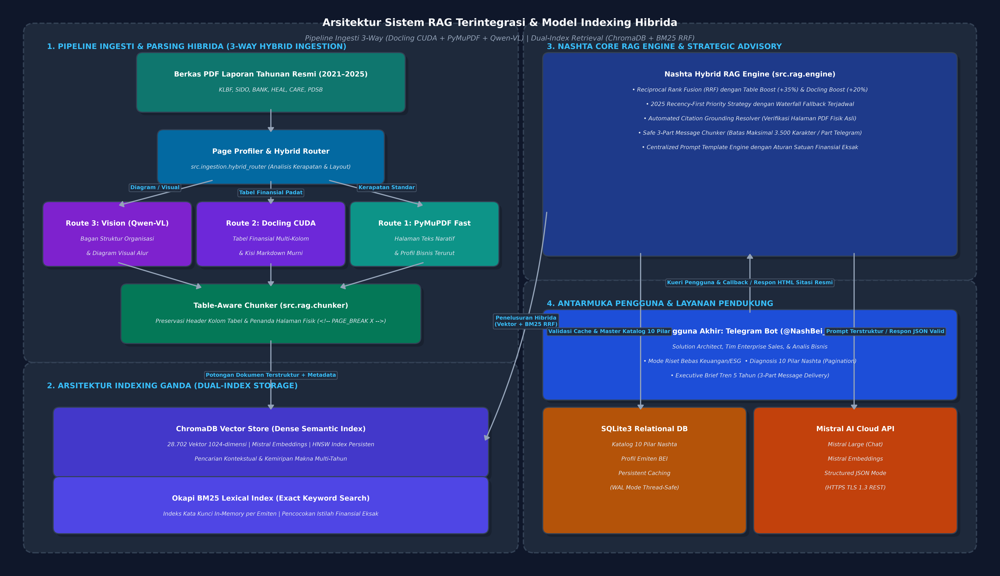
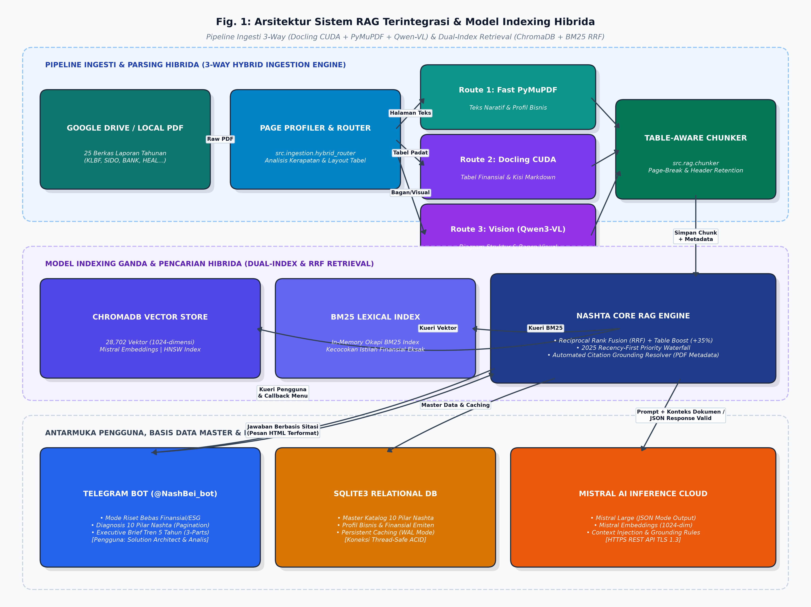
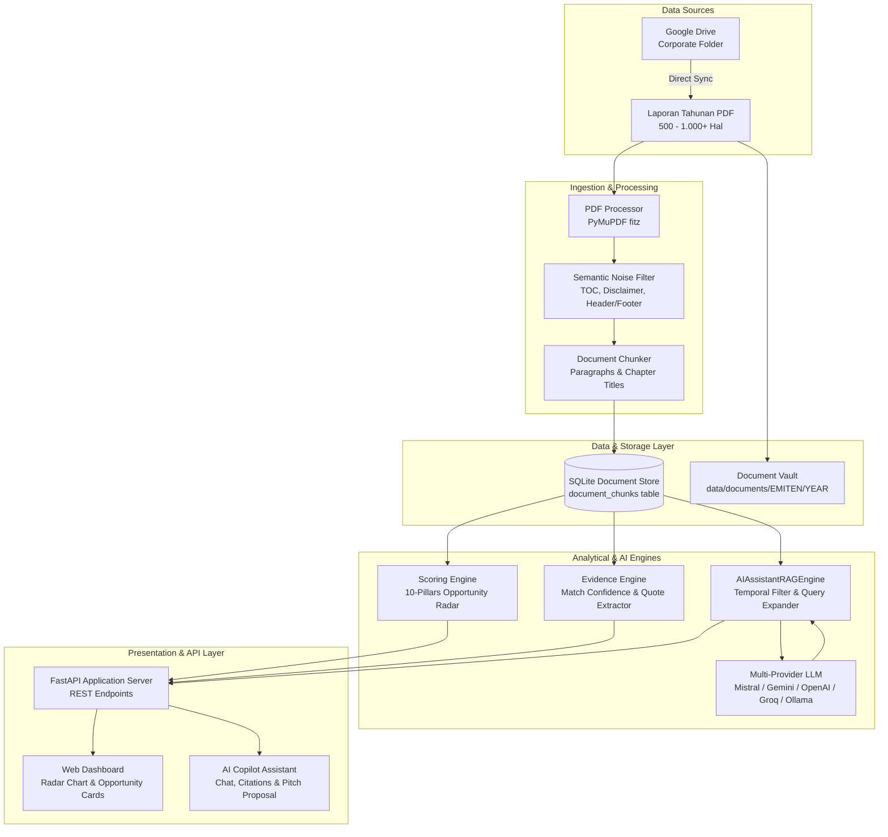
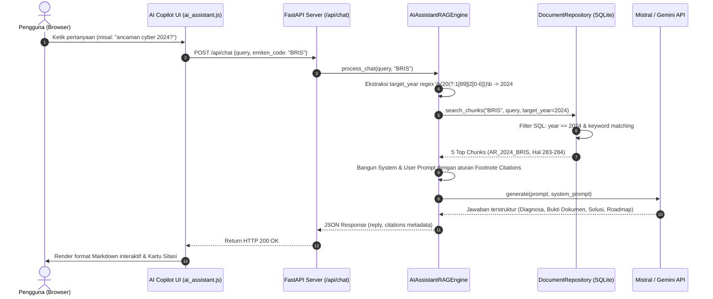

# Arsitektur Sistem

Dokumen ini menjelaskan arsitektur perangkat lunak, komponen inti, dan alur data *end-to-end* dari sistem **Nashta Annual Report RAG & AI Copilot**.

---

## 📐 Gambaran Umum Arsitektur

Sistem dibangun menggunakan pendekatan modular berbasis **Python (FastAPI)** pada backend dan antarmuka web responsif berbasis **Vanilla JavaScript & Tailwind CSS** pada frontend, tanpa dependensi framework frontend yang berat.

---

### 🌐 System Context Diagram

---

### 📊 Diagram Komponen Sistem

---

## 🧩 Komponen Utama Sistem

### 1. Ingestion & PDF Pipeline (`backend/pdf_processor.py`, `backend/gdrive_sync.py`)
- **PyMuPDF (`fitz`)**: Mengekstrak teks dari setiap halaman PDF dengan menjaga nomor halaman fisik dokumen (*physical page*) dan nomor halaman tercetak (*printed page*).
- **Noise Gatekeeper**: Menyingkirkan teks non-substantif seperti daftar isi (*Table of Contents*), kata pengantar berulang, disclaimer auditor standar, serta header/footer nomor registrasi.
- **Chapter Identification**: Mendeteksi bab laporan tahunan (contoh: *Transformasi Digital & Strategi TI*, *Tata Kelola Perusahaan*, *Laporan Manajemen*) untuk memberikan konteks pada setiap potongan teks.

### 2. Document Store & Indexer (`backend/repository.py`, `backend/database.py`)
- **Tabel `document_chunks` (SQLite)**: Menyimpan setiap paragraf dengan metadata lengkap:
  - `chunk_id`: Identifier unik (format: `{EMITEN}_{YEAR}_p{PAGE}_{IDX}`).
  - `emiten_code`: Kode saham (contoh: `BRIS`, `BBCA`).
  - `year`: Tahun laporan (2021 s/d 2025).
  - `chapter_title`: Bab dokumen tempat teks ditemukan.
  - `printed_page` & `page_number`: Penomoran halaman laporan.
  - `raw_paragraph`: Teks asli paragraf.
  - `is_noise`: Status filter noise.

### 3. Scoring & Evidence Engine (`backend/scoring_engine.py`, `backend/evidence_engine.py`)
- Menganalisis kebutuhan emiten terhadap 10 Pilar Solusi Nashta secara deterministik.
- Menghasilkan **Nashta Opportunity Index (0-100)**, daftar prioritas solusi, estimasi nilai proyek (*deal size*), dan mengidentifikasi bukti kutipan kalimat konkret.

### 4. RAG Engine & Temporal Router (`backend/rag_engine.py`)
- Menangani dialog konsultasi dengan pengguna.
- Dilengkapi **Temporal Router**: mendeteksi tahun yang ditanyakan pengguna dan secara ketat membatasi pencarian hanya pada dokumen tahun tersebut.
- Mengirimkan konteks dokumen asli ke Generative LLM untuk merumuskan diagnosa eksekutif dan rekomendasi arsitektur.

### 5. Multi-Provider LLM Gateway (`backend/llm_provider.py`)
- Mendukung berbagai provider AI secara dinamis melalui file konfigurasi `.env`:
  - **Mistral AI**: `ministral-8b-latest` (default).
  - **Google Gemini**: `gemini-1.5-flash`.
  - **OpenAI**: `gpt-4o-mini` atau model kustom.
  - **Groq**: `llama-3.3-70b-versatile`.
  - **Ollama**: Model lokal offline (misal: `qwen2.5:7b`).
  - **Offline Fallback**: Generator berbasis aturan murni jika tidak ada koneksi internet / API key.

---

## 🔄 Alur Eksekusi Permintaan Pengguna (Runtime Flow)

Berikut urutan proses ketika pengguna mengajukan pertanyaan di AI Copilot:

