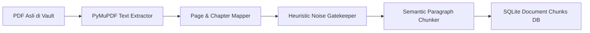

# Pipeline Ingestion & Google Drive Sync

Dokumen ini menjelaskan alur pemrosesan dokumen PDF laporan tahunan (*PDF Ingestion Pipeline*), pembersihan data (*Noise Filtering*), hingga mekanisme sinkronisasi langsung dengan **Google Drive**.

---

## 📑 Alur Pipeline Pemrosesan PDF

Laporan Tahunan emiten BEI umumnya berukuran besar (50 MB s/d 250 MB per dokumen) dengan jumlah halaman antara 500 hingga 1.200 halaman. Sistem memproses file tersebut secara bertahap:



### 1. Ekstraksi Halaman dengan PyMuPDF (`fitz`)
- Menjaga dua jenis penomoran halaman:
  - **`physical_page`**: Nomor urut halaman fisik di dalam PDF (1, 2, 3, ...).
  - **`printed_page`**: Nomor halaman resmi yang tercetak di sudut bawah halaman laporan.
- Mengekstrak heading judul bab (*Chapter Title*) menggunakan analisis ukuran font dan tata letak teks.

### 2. Semantic Noise Filtering (`is_noise`)
Tidak semua halaman di dalam Annual Report memuat informasi bernilai bisnis. Sistem secara otomatis menandai dan mengabaikan halaman noise:
- **Daftar Isi (Table of Contents)**: Mengandung deretan titik-titik dan angka halaman berulang.
- **Kata Pengantar Seremonial**: Halaman sambutan formal tanpa indikasi operasional TI.
- **Laporan Auditor Independen**: Halaman opini akuntan publik standar OJK.
- **Daftar Kantor Cabang & ATM**: Daftar alamat fisik dan nomor telepon yang berulang.

### 3. Chunking Strategy
- Teks dipecah per unit paragraf substantif dengan panjang optimal $150 - 600$ karakter.
- Setiap chunk mempertahankan *context window* berupa nama bab dan nomor halaman agar dapat direferensikan kembali secara akurat.

---

## ☁️ Integrasi Google Drive (*Cloud Sync*)

Untuk memudahkan tim analis menambahkan laporan tahunan baru tanpa perlu mengunggah secara manual satu per satu, sistem dilengkapi modul **Google Drive Sync** (`backend/gdrive_sync.py` & `backend/gdrive_ingestor.py`).

### Fitur Utama GDrive Sync:
1. **Direct Download from Shared Folder**: Mengunduh file PDF emiten secara langsung menggunakan URL folder publik Google Drive.
2. **Auto-Organize Vault**: Menyimpan PDF ke struktur folder vault terstandarisasi:
   ```
   data/
   └── documents/
       ├── BRIS/
       │   ├── AR_2021_BRIS_Annual_Report_2021.pdf
       │   ├── AR_2022_BRIS_Annual_Report_2022.pdf
       │   ├── AR_2023_BRIS_Annual_Report_2023.pdf
       │   ├── AR_2024_BRIS_Annual_Report_2024.pdf
       │   └── AR_2025_BRIS_Annual_Report_2025.pdf
       └── BBCA/
           └── AR_2024_BBCA_Annual_Report_2024.pdf
   ```
3. **Deduplication Check**: Memeriksa ukuran file dan checksum MD5 agar tidak mengunduh ulang file yang sudah ada di sistem.
4. **Incremental Ingestion**: File baru langsung diproses dan dimasukkan ke dalam database chunk tanpa menghapus data emiten yang sudah ada.

### Cara Menjalankan Sinkronisasi:

#### Melalui Endpoint REST API:
```http
POST /api/gdrive/sync HTTP/1.1
Host: localhost:8000
Content-Type: application/json

{
  "folder_url": "https://drive.google.com/drive/folders/YOUR_FOLDER_ID"
}
```

#### Melalui Command Line:
```bash
python backend/gdrive_sync.py --url "https://drive.google.com/drive/folders/YOUR_FOLDER_ID"
```
