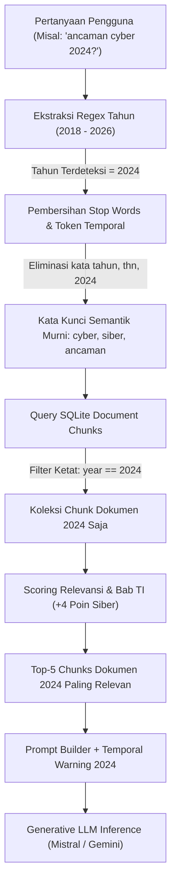

# RAG Engine & Temporal Query Filtering

Dokumen ini menjelaskan mekanisme kerja mesin **Retrieval-Augmented Generation (RAG)**, penanganan pertanyaan berbasis waktu (*Temporal Query Filtering*), serta rekayasa prompt (*Prompt Engineering*) pada sistem.

---

## 🔍 Filosofi True RAG vs Halusinasi Generatif

Model bahasa besar (LLM) standar memiliki kecenderungan melakukan "halusinasi" atau mengarang data ketika ditanya mengenai detail spesifik sebuah perusahaan.

Sistem ini menerapkan arsitektur **True RAG**:
1. **No Assumption Policy**: LLM tidak diperbolehkan menjawab pertanyaan faktual emiten hanya dari pengetahuan bawaannya (*pre-trained knowledge*).
2. **Context Injection**: Sistem mengekstrak potongan paragraf terverifikasi dari database lokal laporan tahunan, lalu menyuntikkannya sebagai satu-satunya dasar referensi resmi (`[DATA REFERENSI RESMI BUKTI LAPORAN TAHUNAN]`).
3. **Footnote Numbering**: Setiap klaim fakta diwajibkan menyertakan penomoran *footnote* `(1)`, `(2)` yang merujuk langsung ke dokumen, halaman, dan bab yang sah.

---

## ⏳ Temporal Query Filtering (Filter Berbasis Tahun)

Salah satu tantangan terbesar dalam membaca Laporan Tahunan adalah penanganan **tahun laporan yang berbeda-beda**. 

Sebagai contoh, ketika pengguna menanyakan:
> *"Apa ancaman cyber yang terjadi pada tahun 2024?"*

Jika sistem hanya menggunakan pencarian semantik teks tanpa kesadaran temporal (*temporal blindness*), laporan tahun 2025 yang memuat tabel komparatif catatan keuangan bertuliskan *"tahun 2024"* dapat keliru terambil.

### Alur Kerja Temporal Filter



### 1. Ekstraksi Regex Otomatis
Sistem mendeteksi keberadaan tahun menggunakan pola regex:
```python
year_match = re.search(r"\b(20(?:1[89]|2[0-6]))\b", query_text)
if year_match:
    target_year = int(year_match.group(1))
```

### 2. Eliminasi Stop Words & Kata Temporal
Agar angka tahun dan kata waktu tidak mengotori skor kecocokan, sistem memfilter kata-kata berikut sebelum pencarian:
```python
stop_words = {
    "apa", "siapa", "dimana", "kapan", "bagaimana", "mengapa", "yang", "dan", "dari",
    "untuk", "pada", "dengan", "ini", "itu", "saya", "anda", "kami", "mereka", "yan",
    "adalah", "terjadi", "saat", "ketika", "tahun", "thn", "th", "annual", "report",
    "laporan", "apakah", "tentang", "mengenai", "dalam", "atas", "bisa", "dapat"
}
```

### 3. Ekspansi Sinonim Otomatis
Mendukung istilah dwibahasa (bilingual) umum di perbankan Indonesia:
- `cyber` $\longleftrightarrow$ `siber`

### 4. Pembobotan Relevansi Khusus (*Bonus Scoring*)
Chunk teks diberikan poin tambahan jika mengandung terminologi kritis dan berasal dari bab tata kelola TI:
- **$+4$ Poin**: Mengandung kata kunci kritis (`keamanan siber`, `cyber security`, `insiden`, `mitigasi`, `serangan`, `perlindungan data`, `soc`, `vapt`).
- **$+2$ Poin**: Mengandung kata kunci TI umum (`teknologi`, `sistem`, `digital`, `cloud`, `data`).
- **$+3$ Poin**: Berasal dari bab yang relevan (`Teknologi`, `TI`, `IT`, `Tata Kelola`, `Operasional`, `Risiko`).

---

## 🤖 Standar Prompt Footnote Citations

Agar laporan diagnosa dapat langsung dipakai oleh tim sales dan konsultan, prompt AI Copilot mewajibkan format sitasi berikut:

```markdown
1. 🔍 Diagnosa Utama dari Laporan Tahunan {EMITEN}
   - Paparkan indikator masalah dengan footnote (1), (2), (3) tepat di akhir klaim kalimat.
   - Contoh: "Uji coba BCP/DRP dilakukan secara periodik (1), namun belum menggunakan otomatisasi AI."

### 📑 Bukti Dokumen
(1) "[Kutipan kalimat fakta persis dari dokumen]" — [Nama Dokumen] ([Tahun]), [Halaman & Bab]
(2) "[Kutipan kalimat fakta persis dari dokumen]" — [Nama Dokumen] ([Tahun]), [Halaman & Bab]

2. 🚀 Rekomendasi Solusi Nashta
   - Paket solusi terpadu, komponen arsitektur, dan tabel perbandingan fitur & manfaat.

3. 🛠️ Rencana Kerja & Tahapan Implementasi
   - Roadmap implementasi tuntas (Fase 1 s/d Fase 3) dengan durasi dan rincian aktivitas.
```

---

## ⚙️ Multi-Provider LLM Support

Sistem mendukung fleksibilitas konfigurasi LLM melalui file `.env`:

```bash
# Contoh konfigurasi di .env:
MISTRAL_API_KEY=your_mistral_api_key
MISTRAL_MODEL=ministral-8b-latest

# Opsi alternatif yang didukung:
GEMINI_API_KEY=your_google_api_key
OPENAI_API_KEY=your_openai_api_key
GROQ_API_KEY=your_groq_api_key
OLLAMA_BASE_URL=http://localhost:11434
```

Jika tidak ada kunci API yang aktif, sistem otomatis berpindah ke **Deterministic Rule-based RAG Fallback** yang tetap memberikan kutipan dokumen dan rekomendasi paket solusi secara akurat tanpa koneksi internet.
